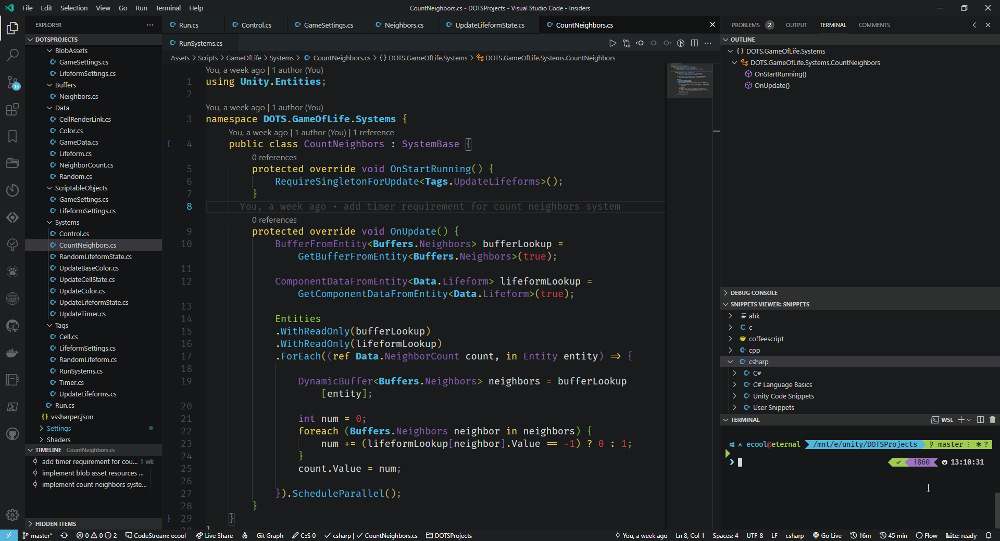

# Info
This is a port of the Atom theme `seti-classic`, which is also a fork of the original `seti-ui`, for VSCode.

This does not include the seti-icons because that is already included in VSCode.

# Known Issues
* Currently there seems to be some weird interaction between Semantic Highlighting and the VSCode File Changes Side-by-Side view. [VSCode Issue](https://github.com/microsoft/vscode/issues/126722)

## See:
[seti-classic](https://github.com/vermotr/seti-classic)
[seti-classic-syntax](https://github.com/vermotr/seti-classic-syntax)
[seti-ui](https://github.com/jesseweed/seti-ui)
[seti-syntax](https://github.com/jesseweed/seti-syntax)
